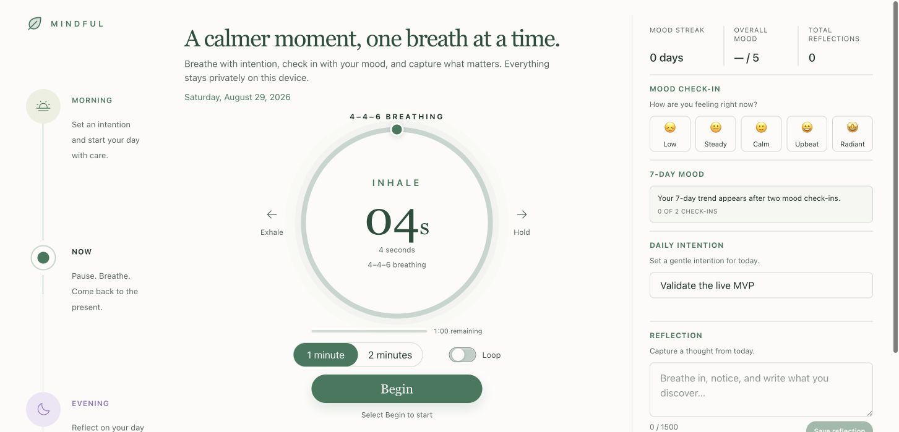

# Mindful

[](https://github.com/seonglinchua/mindful/actions/workflows/deploy.yml)

A calm, private wellness tracker for guided breathing, daily mood check-ins, intentions, and short reflections. Mindful runs entirely in the browser: no account, backend, analytics service, or network API is required.

**Live app:** [seonglinchua.github.io/mindful](https://seonglinchua.github.io/mindful/)



## What you can do

- Follow a guided **4–4–6 breathing** session
- Choose a one- or two-minute session and optionally loop it
- Pause, resume, reset, and follow overall session progress
- Record a daily mood and build a seven-day history
- Track a mood streak and overall average
- Set an autosaved daily intention
- Create, edit, delete, and restore reflections
- Use the experience across desktop and mobile layouts

Mindful also includes visible keyboard focus, semantic control states, polite status announcements, and reduced-motion support.

## Privacy and persistence

Personal wellness data stays in the current browser profile through `localStorage`.

| Storage key | Contents |
| --- | --- |
| `mindful:breath-loop` | Loop preference |
| `mindful:moods` | Dated mood check-ins |
| `mindful:intentions` | Daily intentions indexed by date |
| `mindful:journals` | Reflection entries |

Breathing-session progress is intentionally temporary and resets after refresh. Clearing site data removes all saved Mindful data. Version 0.1.0 does not include accounts, synchronization, cloud backup, or export.

## Tech stack

- Next.js 15 App Router
- React 19 and TypeScript
- Tailwind CSS 4
- Phosphor Icons
- Static export hosted with GitHub Pages

## Run locally

Requirements: Node.js 20+ and npm 10+.

```bash
git clone https://github.com/seonglinchua/mindful.git
cd mindful
npm ci
npm run dev
```

Open [http://localhost:3000](http://localhost:3000).

## Validate and preview

```bash
npm run lint
npm run build
npm run serve
```

`npm run build` creates the static site in `out/`. `npm run serve` previews a root-path build from that directory.

Available scripts:

| Command | Purpose |
| --- | --- |
| `npm run dev` | Start the Turbopack development server |
| `npm run lint` | Run ESLint |
| `npm run build` | Create the production static export |
| `npm run serve` | Serve the generated `out/` directory |

## GitHub Pages deployment

Pushes to `main` trigger [the deployment workflow](.github/workflows/deploy.yml). It installs locked dependencies, builds with the `/mindful` base path, uploads `out/`, and deploys through GitHub Pages.

To reproduce that build locally:

```bash
NEXT_PUBLIC_BASE_PATH=/mindful npm run build
```

In the GitHub repository settings, Pages should use **GitHub Actions** as its source.

## Project structure

```text
app/
  globals.css          Design tokens, layout, and interaction states
  layout.tsx           Root metadata and fonts
  page.tsx             Wellness tracker and feature logic
components/ui/         Reusable interface controls
lib/
  use-local-storage.ts Hydration-safe browser persistence
  utils.ts             Shared class-name utility
.github/workflows/     GitHub Pages automation
```

## Release

The current MVP is **v0.1.0**. See [CHANGELOG.md](CHANGELOG.md) for included functionality and release notes.
